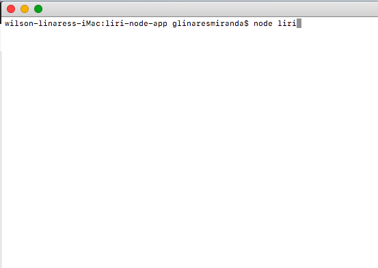
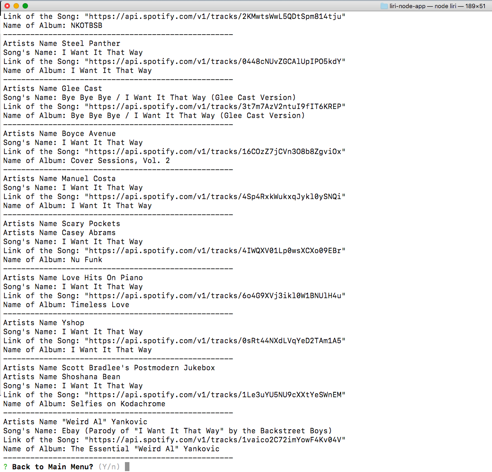
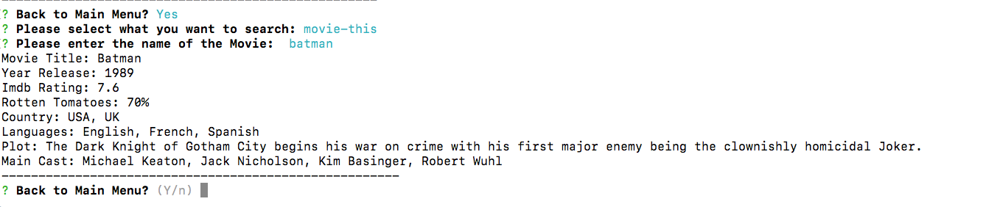
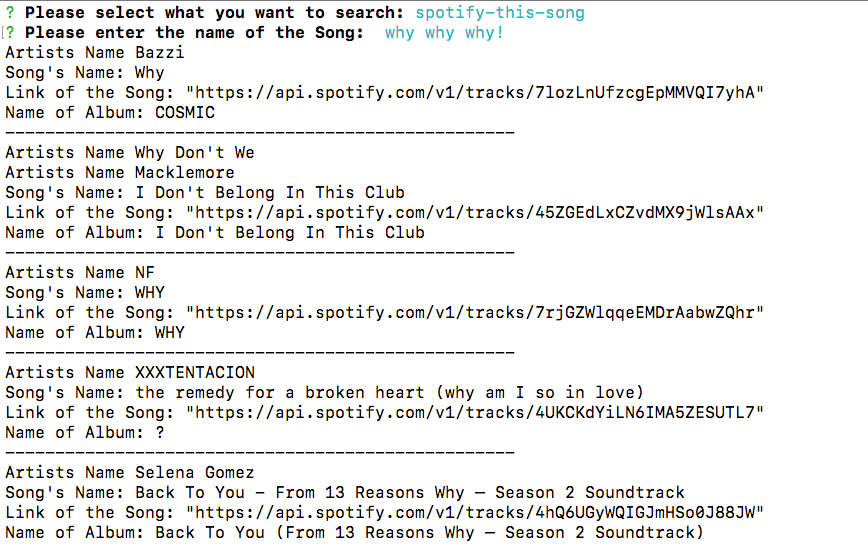

# Liri-node-app

## What is liri
Liri is a node app, that presents a menu with four options to search in three different APIs, the last option is to perfomr a ramdon search, with information read from a file name ramdon.txt, and a fith option to exit the app.

## How to run liri
To run liri it is necesary to execute the command *node liri* in the command line of the main directory of the app like so: 

## How liri Works

1. After the comdand line is executed liri displays a menu with five choices from where the user can choose by using the up and down keys from the keyboard. After the user select one option it is ask for the name of the band/artist, movie or song that wants to search.
1. When the user selects the the fourth option, the app reads the file named **ramdom.txt** and converts the data read into an array, ramdomly picks an element and according to the option read **(spotify-this, movie-this, etc), search in the respective API and display in the console the return data from the API: 
1. The option Concert-This and Movie-This uses the npm package *axios* to request the data in the respective API and consoles the information retrieve as it is reflected in the next images.  
1.For the spotify option, the app uses the npm package **node-spotify-api**, the use of this API requieres a personal *api key* and a *secret key* provided by spotify when registering, this makes necesary the use of the npm package *dotenv* and the creatio of a key.js file to key the values of the keys private when the app is uploaded to a *github* repository. The result of this option is also display in the console. 
1.All of the data that is consol from the searches is also store as with a JSON format in a file named log.txt, and the parameters of the search store in the file random.txt separated for commas, so later can be use in the random search of the fourth option of the menu.
1.To exit the app, the user can do it from the main menu or after a search result is display, the app gives the option to return to the main menu or not!
1. All the functionality of the app it is contain in the file liri.js, to undertand how it works follow the flow of the functions starting with the function **menu()**.

### The following links will demostrate the functionality of the liri app (). 
* Demostrating the four options: [showing how the choices work](https://youtu.be/l_FFKkNJeoM)
* Demostrating just the ramdon option: [showing the random option](https://youtu.be/uHuyU0PjKq8)

